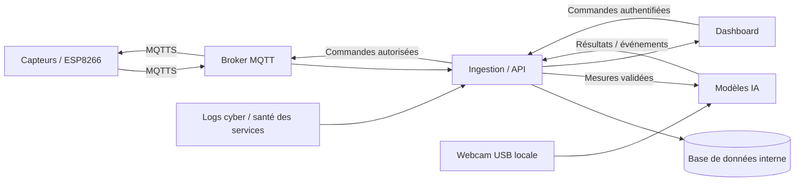

# The Watcher

Projet du Workshop EPSI BAC+4 2026 — **Mission Sentinel-X : l’Avant-Poste Industriel du Futur**.

Sentinel-X est un prototype de supervision cyber-physique développé pendant un sprint de quatre jours. Il rassemble les mesures de capteurs, l’analyse vidéo locale, les résultats des modèles IA et les informations de sécurité dans une application de monitoring unique.

L’objectif est de livrer une démonstration intégrée et stable, avec des choix techniques simples, utiles et défendables devant un jury.

> État du dépôt : structure initiale et documentation. Les fonctionnalités décrites ci-dessous sont les objectifs du projet ; elles ne sont pas encore implémentées.

## Organisation du dépôt

Un seul dépôt commun à l’équipe, avec un dossier par partie du projet.

| Dossier | Contenu |
| --- | --- |
| [`modeles-ia/`](modeles-ia/) | Vision, analyse des séries temporelles, préparation des données et évaluation des modèles |
| [`database/`](database/) | Schéma de données, migrations et historique des mesures, événements et alertes |
| [`api/`](api/) | Réception et validation des données, API, authentification et commandes autorisées |
| [`front/`](front/) | Dashboard, graphiques, caméra, incidents et état des services |
| [`iot/`](iot/) | Firmware ESP8266 en C++, capteurs, OLED et actionneurs |
| [`infra/`](infra/) | Déploiement, conteneurs, broker MQTT, réseau et monitoring |
| [`cyber/`](cyber/) | Configuration de sécurité, vérifications et rapport de pentest |
| [`docs/`](docs/) | Architecture, contrats d’interface, organisation du sprint et livrables |

## Fonctionnement général

Les capteurs ne communiquent jamais directement avec la base de données. L’ingestion valide les messages et ajoute l’heure de réception avant leur stockage et leur traitement. L’heure de mesure est conservée lorsqu’elle est disponible.

La webcam USB est branchée directement au serveur local. Les modèles IA y analysent les images et l’évolution des mesures. Leurs résultats sont transmis à l’API pour être affichés et historisés.

Les alertes peuvent rapprocher plusieurs observations : présence dans une zone surveillée, dérive environnementale et événement cyber. Cette logique reste dans les modules existants, sans service supplémentaire dédié. Une donnée indisponible doit apparaître comme telle et ne pas être interprétée comme une situation normale.

## Fonctionnalités visées

- Afficher les mesures des capteurs en temps réel et leur historique.
- Montrer le retour caméra et les événements de présence détectés.
- Analyser l’évolution des capteurs pour détecter des anomalies temporelles.
- Afficher les résultats IA et les causes des alertes.
- Conserver un historique des incidents et permettre leur acquittement.
- Superviser la disponibilité des services et la fraîcheur des données.
- Afficher les événements cyber disponibles : refus d’authentification, messages invalides et événements du pentest.
- Commander les LEDs ou le buzzer via une API sécurisée, avec retour d’état.

L’acquittement d’une alerte indique sa prise en compte ; il ne signifie pas que sa cause a disparu.

## Contraintes du sujet et choix ouverts

Le sujet officiel EPSI reste la référence. Les exemples techniques ne deviennent pas automatiquement des obligations.

| Élément | Cadre retenu |
| --- | --- |
| Firmware | C++ sur ESP8266, demandé explicitement |
| Vision | Script Python local, webcam USB directement connectée au serveur, détection d’une présence humaine suspecte |
| Performance vidéo | Traitement attendu inférieur à 100 ms par trame ; résolution à adapter et performance à mesurer |
| Analyse des capteurs | Détection d’anomalies temporelles ; de simples seuils statiques ne suffisent pas |
| Serveur | PC d’un membre ou Raspberry Pi 5, deux variantes autorisées |
| Infrastructure | Docker Compose et Mosquitto prescrits dans la section Infra du sujet, retenus comme base |
| Sécurité | Chiffrement des flux IoT, durcissement et audit offensif encadré |
| Modèles IA | À choisir et à évaluer ; YOLO, OpenCV, Isolation Forest et Random Forest sont des exemples |
| Application et stockage | Framework frontend, backend et base de données à choisir avec l’équipe |

L’interconnexion fonctionnelle des différentes parties est un prérequis de la démonstration. Le boîtier physique, l’OLED et les actionneurs font partie du travail à intégrer.

## Sécurité transverse

- Chiffrer les échanges et authentifier les équipements et utilisateurs.
- Valider les formats, tailles et valeurs des messages ; limiter le débit entrant.
- Autoriser les commandes côté backend et journaliser leur exécution.
- Garder la base de données sur le réseau interne, sans port publié sur le réseau de la table.
- Limiter les ports ouverts, les accès réseau et les privilèges des services.
- Utiliser SSH par clé et isoler les conteneurs.
- Fournir les secrets à l’exécution ; ne jamais versionner mots de passe, jetons ou clés privées.
- Collecter les traces utiles au pentest dans le périmètre autorisé du workshop.

Le dashboard ne doit afficher un état de sécurité comme vérifié que si une vérification réelle et datée existe.

## Travail en équipe

Les filières DEV, IA, INFRA et CYBER contribuent au même système. Chaque partie précise ses données d’entrée, ses sorties et ses dépendances avant son intégration.

- `main` contient le travail intégré.
- Créer des branches courtes par tâche, par exemple `feat/vision-presence`, `feat/api-mesures` ou `feat/dashboard`.
- Faire des commits ciblés et proposer les changements par pull request.
- Documenter les variables de configuration et commandes de lancement lors de l’ajout d’un composant.
- Vérifier régulièrement le parcours complet capteur → API → affichage, puis intégrer l’IA et les commandes.

## Sprint et démonstration

| Jour | Priorité |
| --- | --- |
| Lundi | Valider avec les coachs l’architecture réseau et les flux, répartir les tâches et définir les interfaces |
| Mardi | Développer les composants et établir une première chaîne fonctionnelle |
| Mercredi | Intégrer les mesures réelles, l’IA et le dashboard ; tourner le teaser |
| Jeudi | Stabiliser, réaliser le pentest encadré, corriger et remettre les livrables numériques |
| Vendredi | Présenter le prototype et effectuer la démonstration en direct |

La démonstration doit montrer une mesure réelle, une détection IA, une alerte compréhensible et une action autorisée. Les scénarios simulés ou rejoués doivent être annoncés comme tels.

## Livrables

- Prototype physique fonctionnel : boîtier conçu sous Fusion 360, fabrication et gravure Fablab, électronique intégrée.
- Dossier technique PDF : réseau, câblage, sécurité, documentation IA, audit et poster A3 en annexe.
- Support PowerPoint pour la soutenance.
- Teaser vertical « Sentinel Drop » en MP4 H.264, de 60 secondes maximum.
- Archive du code documentée et sans secrets.

Les fichiers numériques suivent le nommage `Workshop2026-M1-G<n>` précisé dans le sujet et sont remis jeudi soir à l’échéance fixée par les coachs.

## Installation

Aucune application exécutable n’est encore fournie. Les prérequis, configurations et commandes de lancement seront ajoutés dans chaque dossier au fur et à mesure de l’implémentation.
